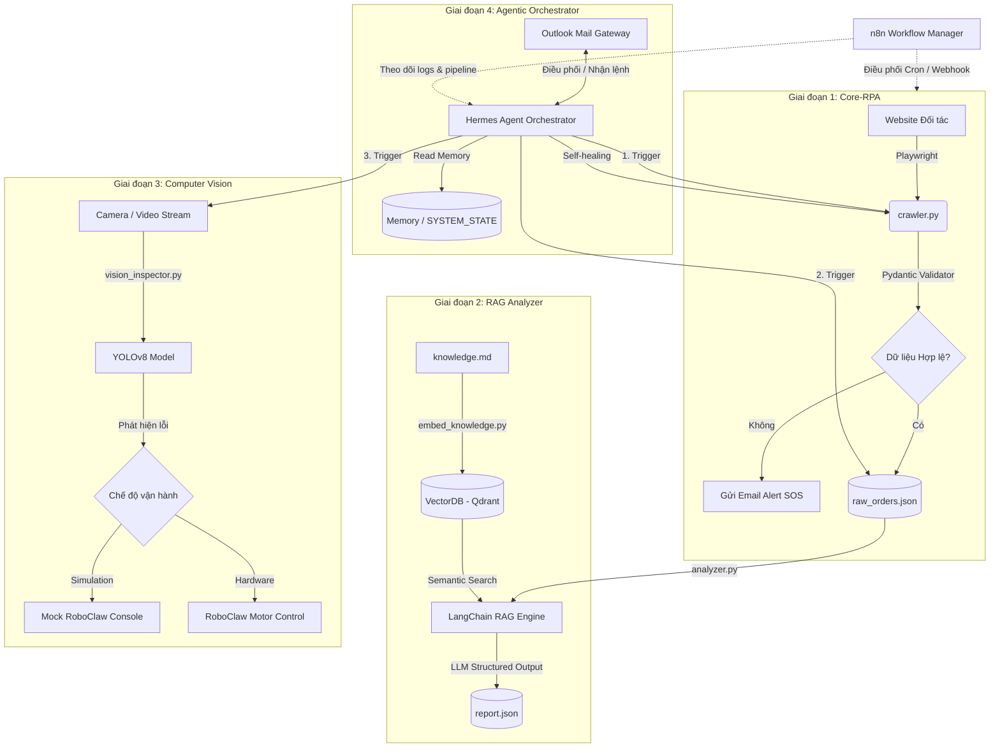

# 🚀 HỆ THỐNG TỰ ĐỘNG HÓA AI (PoC - Proof of Concept)
Hệ thống Tự động hóa Thông minh kết hợp RPA (Robotic Process Automation), RAG (Retrieval-Augmented Generation), Thị giác máy tính (Computer Vision) và Điều phối Agentic (Agentic Orchestrator) nhằm tối ưu hóa chuỗi quy trình vận hành và kiểm soát chất lượng từ đầu đến cuối (End-to-End).

---

## 🏗️ Sơ đồ Kiến trúc Hệ thống E2E

Sơ đồ dưới đây mô tả luồng dữ liệu và sự tương tác giữa các thành phần của hệ thống từ lúc thu thập dữ liệu cho đến khi đưa ra quyết định xử lý và điều phối thông qua cổng giao tiếp Outlook Mail:



---

## 🗂️ Danh sách Tài liệu Đặc tả Chi tiết (SRS)

Hệ thống được thiết kế và đặc tả chi tiết trong thư mục [SRS](file:///e:/Sumi-HN/Smart-poc-automation/SRS):

| Tệp tài liệu | Thành phần Đặc tả | Nội dung chính |
| :--- | :--- | :--- |
| 📑 **[SRS/README.md](file:///e:/Sumi-HN/Smart-poc-automation/SRS/README.md)** | Tổng quan SRS | Sơ đồ kiến trúc E2E, lộ trình phát triển và danh sách thư viện sử dụng. |
| 🟦 **[Phase_1_RPA.md](file:///e:/Sumi-HN/Smart-poc-automation/SRS/Phase_1_RPA.md)** | RPA & Data Pipeline | Quy trình dùng Playwright cào dữ liệu, xử lý CAPTCHA, kiểm định schema bằng Pydantic và gửi cảnh báo email SOS. |
| 🟨 **[Phase_2_RAG.md](file:///e:/Sumi-HN/Smart-poc-automation/SRS/Phase_2_RAG.md)** | RAG & Knowledge Base | Cơ chế nạp VectorDB (Qdrant), kỹ thuật prompt đối chiếu điều khoản SLA doanh nghiệp và xuất báo cáo JSON. |
| 🟧 **[Phase_3_Vision.md](file:///e:/Sumi-HN/Smart-poc-automation/SRS/Phase_3_Vision.md)** | Computer Vision & Motor | Huấn luyện YOLOv8 phát hiện lỗi sản phẩm, điều khiển motor RoboClaw (Simulation & Hardware mode). |
| 🟩 **[Phase_4_Agent.md](file:///e:/Sumi-HN/Smart-poc-automation/SRS/Phase_4_Agent.md)** | Agentic Orchestrator | Hermes Agent Orchestrator quản lý bộ nhớ, tích hợp cổng Outlook Mail và cơ chế tự sửa code (Self-healing). |
| 🛡️ **[System_Integration_Security.md](file:///e:/Sumi-HN/Smart-poc-automation/SRS/System_Integration_Security.md)** | Tích hợp & Bảo mật | Giao thức bảo mật `.env`, phân quyền hòm thư Admin (whitelist), vòng đời dữ liệu và phương pháp đo lường KPIs. |

---

## 🛠️ Công nghệ Sử dụng & Thư viện Chính

Hệ thống được xây dựng trên nền tảng **Python 3.10+** và các công nghệ hiện đại:

*   **RPA**: [Playwright](https://playwright.dev/python/) (Trình duyệt Chromium headless), `pydantic` (Kiểm định schema), `tenacity` (Tự động retry).
*   **Workflow Automation**: `n8n` (Bản Community Edition chạy qua Docker).
*   **Vector Database**: `Qdrant` (Tìm kiếm ngữ nghĩa quy chế nội bộ).
*   **AI/RAG Engine**: `LangChain` / `LangGraph` kết hợp với OpenAI `GPT-4o` hoặc Google `Gemini 1.5 Pro`.
*   **Thị giác máy tính**: `Ultralytics YOLOv8`, `OpenCV` (Xử lý hình ảnh/video real-time).
*   **Điều khiển thiết bị**: `roboclaw_python` (Giao tiếp Serial điều khiển motor gạt vật lý).
*   **Notification & Control**: Microsoft Outlook Mail Gateway (SMTP/IMAP hoặc Microsoft Graph API).

---

## 📁 Cấu trúc Thư mục Dự án

```
project-root/
├── .env                        # Credentials & API Keys (Không commit)
├── .env.example                # Tệp cấu hình mẫu
├── docker-compose.yml          # Cấu hình container n8n và Qdrant
├── requirements.txt            # Danh sách dependencies của Python
├── GEMINI.md                   # Cấu hình và quy định của AI Agent
├── README.md                   # Tài liệu hướng dẫn này
├── plan1.md                    # Kế hoạch triển khai dự án chi tiết
│
├── SRS/                        # Tài liệu đặc tả yêu cầu phần mềm (SRS)
│   ├── README.md
│   ├── Phase_1_RPA.md
│   ├── Phase_2_RAG.md
│   ├── Phase_3_Vision.md
│   ├── Phase_4_Agent.md
│   └── System_Integration_Security.md
│
├── data/                       # Dữ liệu xuất bản/đầu ra của hệ thống
│   ├── raw_orders.json         # Đơn hàng thô từ G1
│   ├── report.txt              # Báo cáo vi phạm dạng văn bản (G2)
│   ├── report.json             # Báo cáo vi phạm dạng cấu trúc JSON (G2)
│   └── defects/                # Thư mục chứa ảnh sản phẩm lỗi (G3)
│
├── logs/                       # Tệp log hoạt động hệ thống
│   ├── crawler_YYYYMMDD.log
│   ├── defect_YYYYMMDD.log
│   └── system_YYYYMMDD.log
│
├── rag/                        # Tài liệu và tri thức RAG
│   └── knowledge.md            # Quy chế, SLA và quy chuẩn nội bộ
│
├── models/                     # Thư mục chứa mô hình AI
│   └── best.pt                 # Trọng số mô hình YOLOv8 đã train
│
├── memory/                     # Bộ nhớ lưu trữ trạng thái của Hermes Agent
│   ├── MEMORY.md               # Nhật ký vận hành và các lỗi đã sửa
│   ├── USER.md                 # Cấu hình người dùng & whitelist email
│   └── SYSTEM_STATE.md         # Trạng thái hiện tại của hệ thống
│
├── src/                        # Mã nguồn dự án
│   ├── crawler.py              # G1: RPA thu thập dữ liệu đơn hàng
│   ├── validator.py            # G1: Kiểm định schema dữ liệu
│   ├── embed_knowledge.py      # G2: Embedding và nạp tri thức vào Qdrant
│   ├── analyzer.py             # G2: Đối chiếu RAG phát hiện vi phạm
│   ├── vision_inspector.py     # G3: Phát hiện lỗi sản phẩm qua YOLOv8
│   ├── actuator.py             # G3: Giao tiếp và điều khiển motor RoboClaw
│   ├── mail_gateway.py         # G4: Gateway điều phối nhận/gửi email Outlook
│   └── agent_orchestrator.py   # G4: Hermes Agent điều phối toàn hệ thống
│
└── tests/                      # Kịch bản kiểm thử tự động
    ├── test_crawler.py
    ├── test_analyzer.py
    └── test_vision.py
```

---

## ⚡ Hướng dẫn Bắt đầu Nhanh (Quick Start)

### 1. Khởi tạo môi trường ảo Python
```bash
python -m venv venv
# Kích hoạt trên Windows:
.\venv\Scripts\activate
# Cài đặt thư viện dependencies:
pip install -r requirements.txt
# Cài đặt trình duyệt Playwright:
playwright install chromium
```

### 2. Thiết lập Tệp Cấu hình `.env`
Sao chép tệp cấu hình mẫu và điền đầy đủ thông tin:
```bash
copy .env.example .env
```
Các thông số cần cấu hình:
- URL và thông tin đăng nhập của Cổng thông tin đối tác.
- OpenAI/Gemini API Key.
- Thông tin tài khoản Outlook Mail dành riêng cho Agent.
- Cấu hình chế độ vận hành phần cứng `HW_MODE` (`true` hoặc `false`).

### 3. Khởi động Dịch vụ Qdrant & n8n
Khởi chạy container thông qua Docker Compose:
```bash
docker-compose up -d
```

### 4. Nạp Tài liệu Tri thức Doanh nghiệp
Chuẩn hóa nội dung trong [rag/knowledge.md](file:///e:/Sumi-HN/Smart-poc-automation/rag/knowledge.md) sau đó chạy script nạp dữ liệu:
```bash
python src/embed_knowledge.py
```

### 5. Chạy Thử nghiệm Hệ thống (Simulation Mode)
Khởi chạy bộ điều phối chính hoặc mail gateway để bắt đầu nhận lệnh:
```bash
python src/agent_orchestrator.py
```

---

## 📈 Tiêu chí Đánh giá Thành công (KPIs)

| Chỉ số KPI | Mục tiêu | Phương pháp Kiểm chứng |
| :--- | :--- | :--- |
| **RAG Accuracy** | `≥ 90%` | So khớp kết quả phân tích của AI trên 100 đơn hàng mẫu đối chiếu với nhãn thủ công. |
| **Vision Precision** | `≥ 80%` | Kiểm tra chỉ số `mAP50` trên tập dữ liệu ảnh lỗi kiểm thử (Test split). |
| **E2E Performance** | `< 3 phút` | Thời gian từ lúc Agent quét lệnh Email đến khi phản hồi báo cáo hoàn tất. |
| **Automation Rate** | `100%` | Vận hành tự trị liên tục không cần can thiệp code bằng tay (môi trường Staging). |
| **System Uptime** | `≥ 24 giờ` | Hệ thống hoạt động liên tục không rò rỉ bộ nhớ hoặc bị crash ngầm. |
| **Self-healing Rate** | `≥ 70%` | Tỷ lệ sửa lỗi CSS selector tự động thành công thông qua LLM & Email approval. |

---

## 🔒 Bảo mật & An toàn thông tin

1. **Thông tin nhạy cảm**: Tuyệt đối không commit file `.env` lên Github.
2. **Whitelist truy cập**: Chỉ các email cấu hình sẵn trong [memory/USER.md](file:///e:/Sumi-HN/Smart-poc-automation/memory/USER.md) mới có quyền gửi lệnh điều khiển.
3. **Data Retention**: Dữ liệu đơn hàng thô (`raw_orders.json`) và ảnh chụp camera (`defects/`) tự động xóa sau **7 ngày** chạy để bảo vệ dữ liệu theo tiêu chuẩn bảo mật.