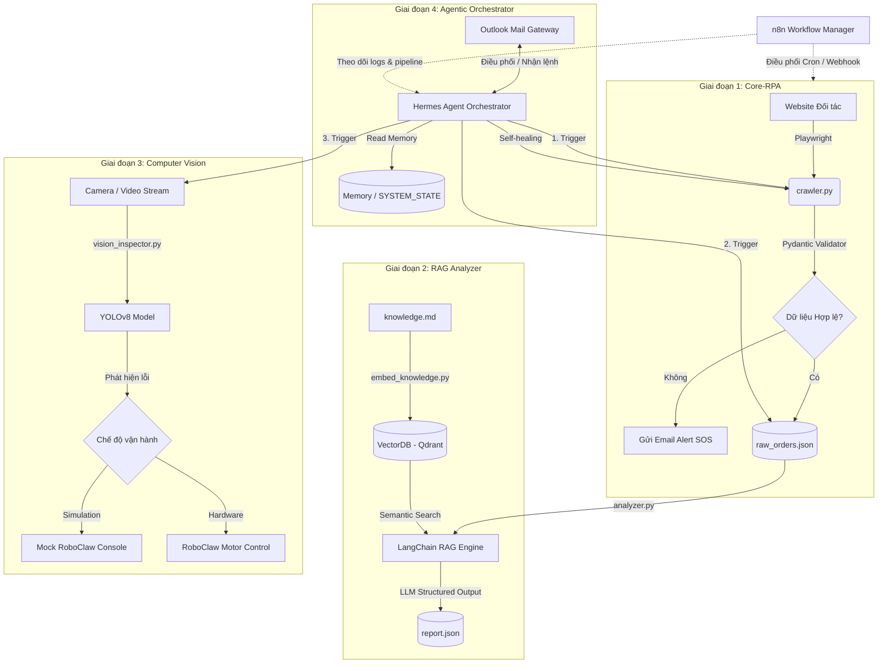

# ĐẶC TẢ YÊU CẦU PHẦN MỀM (SRS) — HỆ THỐNG TỰ ĐỘNG HÓA AI (PoC)

Tài liệu Đặc tả Yêu cầu Phần mềm (Software Requirement Specification - SRS) này cung cấp thông tin chi tiết về mặt kỹ thuật, kiến trúc, quy trình nghiệp vụ và các kịch bản kiểm thử cho dự án Hệ thống Tự động hóa AI (PoC - Proof of Concept).

---

## 🏗️ Sơ đồ Kiến trúc Hệ thống E2E

Sơ đồ dưới đây mô tả luồng dữ liệu và sự tương tác giữa các thành phần của hệ thống từ lúc thu thập dữ liệu cho đến khi đưa ra quyết định xử lý và điều phối thông qua cổng giao tiếp Outlook Mail:

---

## 🗂️ Danh sách Tài liệu Đặc tả Chi tiết

Tài liệu SRS của hệ thống được chia thành các phần chi tiết như sau:

| Tệp tài liệu | Thành phần Đặc tả | Nội dung chính |
| :--- | :--- | :--- |
| **[Phase_1_RPA.md](./Phase_1_RPA.md)** | RPA & Data Pipeline | Cách Playwright cào dữ liệu, xử lý CAPTCHA, schema validation và gửi cảnh báo qua Email. |
| **[Phase_2_RAG.md](./Phase_2_RAG.md)** | RAG & Knowledge Base | Nạp VectorDB (Qdrant), prompt engineering cho LLM và gửi báo cáo phân tích qua Email. |
| **[Phase_3_Vision.md](./Phase_3_Vision.md)** | Thị giác Máy tính & Motor | Fine-tune YOLOv8, điều khiển RoboClaw, và gửi báo cáo sự cố qua Email. |
| **[Phase_4_Agent.md](./Phase_4_Agent.md)** | Agentic Orchestrator | Bộ nhớ Hermes Agent, cổng kết nối Outlook Mail và cơ chế tự sửa lỗi mã nguồn (Self-healing). |
| **[System_Integration_Security.md](./System_Integration_Security.md)** | Tích hợp hệ thống & Bảo mật | Pipeline tích hợp, bảo mật thông tin `.env`, phân quyền Email và đo lường KPIs. |

---

## 🛠️ Công nghệ Sử dụng & Thư viện Chính

Hệ thống được phát triển chủ yếu bằng **Python 3.10+** cùng các thư viện và dịch vụ sau:

*   **RPA**: `Playwright` (Trình duyệt Chromium headless), `pydantic` (Kiểm định dữ liệu), `tenacity` (Tự động retry).
*   **n8n**: Nền tảng workflow tự động hóa dạng Node-based (Chạy qua Docker).
*   **VectorDB**: `Qdrant` (Lưu trữ và tìm kiếm vector tương đồng).
*   **AI/RAG Engine**: `LangChain` / `LangGraph` kết hợp với OpenAI `GPT-4o` hoặc Google `Gemini 1.5 Pro`.
*   **Computer Vision**: `Ultralytics YOLOv8` (Nhận diện vật thể), `OpenCV` (Xử lý hình ảnh/video).
*   **Hardware Control**: `roboclaw_python` (Giao tiếp cổng Serial điều khiển Motor).
*   **Agentic Framework**: Hermes Agent custom orchestrator hoặc `CrewAI` / `LangGraph` cho multi-agent.
*   **Notification & Control**: Microsoft Outlook Mail API (thư viện `msal` & `requests` cho Graph API) hoặc thư viện chuẩn `smtplib` và `imaplib` của Python.

---

## 📈 Lộ trình Phát triển và Tích hợp

1.  **Thiết lập Giai đoạn 1**: Hoàn thiện crawler và pipeline lưu trữ dữ liệu thô.
2.  **Phát triển Song song Giai đoạn 2 & 3**:
    *   Tích hợp VectorDB & LLM phân tích RAG.
    *   Thu thập dataset, gán nhãn, train YOLOv8 và chuẩn bị module RoboClaw (Simulation).
3.  **Tích hợp Giai đoạn 4**: Xây dựng Hermes Agent để kết nối 3 giai đoạn trước đó, tích hợp Outlook Mail làm giao diện điều phối (Frontend) và kích hoạt chế độ Self-healing.
4.  **Kiểm thử E2E & Đánh giá KPIs**: Chạy liên tục hệ thống trong 24 giờ để đo lường các chỉ số chất lượng qua Email.
